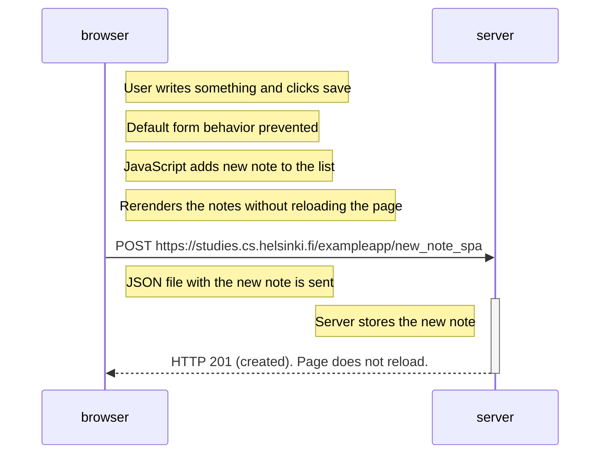

# Adding a new note on SPA
#### https://studies.cs.helsinki.fi/exampleapp/spa

```mermaid
sequenceDiagram
    participant browser
    participant server

    note right of browser: User writes something and clicks save
    note right of browser: Default form behavior prevented
    note right of browser: JavaScript adds new note to the list
    note right of browser: Rerenders the notes without reloading the page
    browser->>server: POST https://studies.cs.helsinki.fi/exampleapp/new_note_spa
    note right of browser: JSON file with the new note is sent
    activate server
    note left of server: Server stores the new note
    server-->>browser: HTTP 201 (created). Page does not reload.
    deactivate server
```